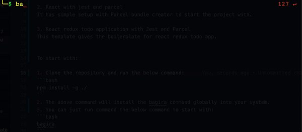

# bagira
Bagira CLI template tool. This is tool same as create react app. This tool gives you boilerplate for various project types. So far three project types has been implemented.

1. NodeJs with ES6.
This is just hello word print in the terminal.

2. React with jest and parcel
It has simple setup with Parcel bundle creator to start the project with.

3. React redux todo application with Jest and Parcel
This template gives the boilerplate for react redux todo app.


To start with:

1. Do
```bash
npm i -g @vijayyadav1002/bagira
```
Or
Clone the repository and run the below command:
```bash
npm install -g ./
```
2. The above command will install the bagira command globally into your system.
3. You can just run the below command to start the cli tool:
```bash
bagira
```

